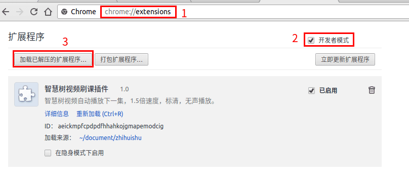

# 智慧树视频刷课插件

初衷：

- 智慧树视频不能在播放完后自动播放下一集，并且偶尔会弹出个对话框，看看你在不在电脑旁看视频! 我想着利用所学的前端知识，写个插件，帮助自己刷课，所以就有了这个chrome插件
- 喜欢这个插件的话，请点右上角的 `star`，谢谢

后续：

- 这个插件我是在2017年12月初写完的，之后再也没有进行调试，所以如果智慧树官网的前端代码发生变化的话，这个插件就会不起作用的
- 今天是2018年3月23号，有朋友向我反映插件用不了。因为我自己的课程也修完了，所以会找师弟师妹借账号，让我调试一下插件代码，我需要点时间，不好意思。还有，因为我现在大四，忙着毕业设计，可能比较少精力放这里，有问题的话请邮件跟我说：perhapszql@gmail.com。
- 今天是2018年3月31号，没能借到智慧树账号，代码无法调试，所以这个插件暂时不能用。请各位还是老老实实的上网课吧~不好意思了。

## 一、功能和工具

功能：

- 只对智慧树视频网站有效(`http://online.zhihuishu.com/onlineSchool/student/index`)
- 播放视频时实现：1.5倍速度，标清，无声播放
- 自动播放视频的下一集
- 对偶尔弹出的`测试`对话款进行关闭处理

需要的工具：

- chrome55+ (我用了es7的语法: `async/await` , 只有chrome55+的js引擎才能解析)

## 二、使用方法

1、打开chrome浏览器，来到 [github.com/perhaps-yo/zhihuishu](github.com/perhaps-yo/zhihuishu) 界面，下载插件源码

解压后的源码放到自己喜欢的目录

2、chrome浏览器输入 `chrome://extensins` ，来到扩展程序页面。按步骤：勾选`开发者模式` -> 单击`加载已解压的扩展程序`，选择刚刚源码的位置 -> 勾选`已启用`。效果如下图：

脚本安装成功，准备刷课！

3、来到智慧树视频网站 [http://online.zhihuishu.com/onlineSchool/student/index](http://online.zhihuishu.com/onlineSchool/student/index)，登录后，到需要刷课的视频页面，就会自动开始刷课啦～

## 三、遇见的问题

- Q: 来到智慧树视频网站后，没能实现 `1.5倍速度，标清，无声播放`？
- A: 按 `f5` 刷新页面。

## 四、License

[MIT](https://github.com/aspnetboilerplate/aspnetboilerplate/blob/dev/LICENSE).
